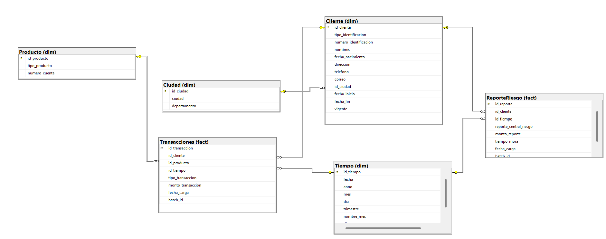
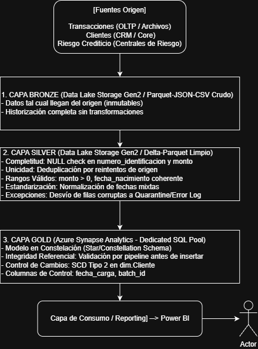

# Prueba Técnica — Ingeniería de Datos (Banco de Bogota)

# 📌 Parte 1: Modelado y Arquitectura de Datos (Teórico - Diseño)

## Instrucciones

1. **Dado el siguiente caso de negocio:**

   *Una entidad bancaria quiere analizar el comportamiento de sus clientes en productos financieros (cuentas de ahorro, tarjetas de crédito y créditos). Para ello, se requiere integrar datos de múltiples fuentes (transacciones, datos de clientes y riesgo crediticio) en un Data Warehouse implementado en GCP.*

2. **Preguntas a desarrollar:**
   - Diseña un modelo **dimensional (modelo estrella o copo de nieve)** para el caso presentado.
   - Justifica tu elección del modelo, destacando sus ventajas para el análisis en entornos de BI y reporting.
   - Propón una estrategia de particionamiento y clustering que permita optimizar las consultas en BigQuery.
   - Describe cómo garantizarías la calidad y la gobernanza de los datos a lo largo del pipeline.
   - Explica qué mecanismos implementarías para asegurar la trazabilidad y auditoría de los datos procesados.

---

## Criterios de Evaluación

a. Diseño de modelo lógico y físico adecuado  
b. Estrategias de optimización y escalabilidad  
c. Consideraciones de calidad, gobierno y seguridad

## Respuesta

**Figura 1.** Diagrama del modelo

parte1-modelado/
├── README.md
├── diagrama.png
├── arquitectura.png
├── 01_modelo_sqlserver.sql
└── 02_modelo_synapse.sql

### Justificación del modelo dimensional
Elegí una constelación de hechos (galaxy schema): dos tablas de hechos (fact.Transacciones y fact.ReporteRiesgo) que comparten dimensiones conformadas (dim.Cliente, dim.Tiempo), con dim.Ciudad normalizada en copo de nieve respecto a dim.Cliente.

La razón es que el caso de negocio integra dos procesos con grano distinto, transacciones (una fila por movimiento) y riesgo crediticio (una fila por reporte de central de riesgo por periodo). Forzarlos en una sola tabla de hechos generaría duplicación de filas al hacer join. Al compartir dim.Cliente y dim.Tiempo como dimensiones conformadas, un analista puede cruzar ambos procesos sin reconciliar modelos separados, esto le da  una vista 360° del cliente.

**Ventajas para BI y reporting:**
- Menos joins que un snowflake completo, lo que se traduce en consultas más simples y rápidas en Power BI.
- Escalable: un tercer proceso de negocio (reclamos) se integra como una tercera tabla de hechos reutilizando las dimensiones existentes.
- dim.Cliente maneja SCD (Slowly Changing Dimension) tipo 2 (histórico de cambios), permitiendo análisis retrospectivos correctos — crítico para auditorías bancarias.

### Estrategia de particionamiento y clustering
| Estrategia                          | En BigQuery (nativo del caso)                                      | En Synapse (implementación real de esta prueba)                                                                 |
|-------------------------------------|--------------------------------------------------------------------|------------------------------------------------------------------------------------------------------------------|
| Particionamiento                    | PARTITION BY DATE(fecha) sobre las tablas de hechos                | PARTITION (id_tiempo RANGE RIGHT FOR VALUES (...)) — partición mensual sobre fact.Transacciones y fact.ReporteRiesgo |
| Clustering                          | CLUSTER BY id_cliente — ordena físicamente filas dentro de cada partición | Ordered Clustered Columnstore Index: CLUSTERED COLUMNSTORE INDEX ORDER (id_cliente)                              |
| (sin equivalente en BigQuery)       | —                                                                  | Distribución HASH(id_cliente) en dimensión y hechos por igual, para lograr joins co-localizados sin movimiento de datos entre nodos — concepto propio de motores MPP |

**Figura 2.** Diagrama arquitectura

**Trazabilidad y auditoría**
- Columnas de control en cada tabla de hechos: fecha_carga y batch_id (identificador único por ejecución del pipeline, que agrupa todas las filas cargadas en esa corrida —permite reprocesar o hacer rollback de un batch completo sin tocar el resto de la tabla).
- Historización con SCD tipo 2 en dim.Cliente: conserva el estado exacto del cliente en cada punto del tiempo, no solo el estado actual.

### Calidad y gobernanza de datos
Como se ilustra en la Figura 2, la calidad se aplica de forma incremental en cada capa:
completitud y unicidad en Silver, e integridad referencial en Gold antes de insertar en las
tablas de hechos (recordando que Synapse no aplica FOREIGN KEY(), por lo que esta validación
es responsabilidad del pipeline, no del motor de base de datos).

### Calidad y Gobernanza de Datos

La calidad de datos se aplica de forma incremental a lo largo de las capas del Data Lakehouse:
- **Capa Silver:** Validaciones de completitud (chequeo de `NULL`s en campos clave), unicidad y rangos válidos.
- **Capa Gold:** Validación de integridad referencial previo a la inserción en el *Dedicated SQL Pool* (considerando que motores MPP como Synapse no fuerzan restricciones físicas de `FOREIGN KEY`, por lo que este control se delega a la lógica del pipeline de integración).

| Dominio | Implementación en Azure | Equivalente Homólogo en GCP |
| :--- | :--- | :--- |
| **Catálogo de Datos y Lineage** | **Microsoft Purview:** Escaneo automático de datasets, clasificación de columnas con PII (`numero_identificacion`, `telefono`, `correo`) y trazabilidad (*lineage*) desde el archivo en Data Lake Gen2 hasta la capa Gold. | **Dataplex (Data Catalog).** |
| **Enmascaramiento y Control de Acceso** | **Dynamic Data Masking (DDM):** Enmascaramiento dinámico en Synapse para ocultar PII a usuarios no autorizados, complementado con políticas de seguridad a nivel de fila y columna (*Row/Column Level Security*). | **BigQuery Policy Tags & Dynamic Data Masking.** |
| **Cifrado de Datos** | **Cifrado en reposo y tránsito:** Utilización de Azure Storage Encryption, Transparent Data Encryption (TDE) en Synapse y protocolos TLS en tránsito. | **Cloud KMS**|
