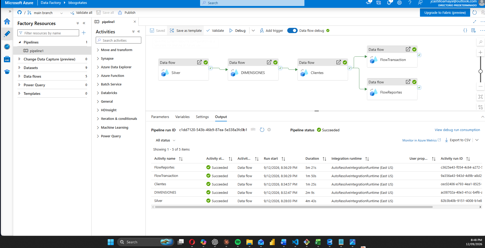
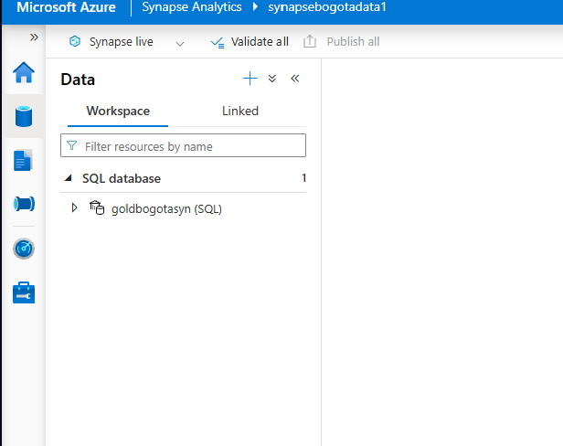

# Prueba Técnica — Ingeniería de Datos (Banco de Bogota)

# 📌 Parte 2: Construcción de Pipeline ETL/ELT (Práctico - Implementación)

## Instrucciones

1. **Se proporciona un dataset de ejemplo en formato CSV o JSON con datos de transacciones bancarias.**

   *Una entidad bancaria quiere analizar el comportamiento de sus clientes en productos financieros (cuentas de ahorro, tarjetas de crédito y créditos). Para ello, se requiere integrar datos de múltiples fuentes (transacciones, datos de clientes y riesgo crediticio) en un Data Warehouse implementado en GCP.*

2. **Tareas a realizar:**
   - Cargar los datos en un Data Lake.
   - Aplicar reglas de limpieza, transformación y control de calidad a los datos.
   - Cargar los datos finales en el modelo dimensional.
   - Asegurar que el proceso sea escalable y eficiente.

---

## Criterios de Evaluación

a. Código limpio, modular y eficiente  
b. Implementación correcta de la carga incremental  
c. Uso de servicios adecuados para cumplir con el requerimiento
d.	Manejo óptimo de particionamiento y rendimiento

## Respuesta

**Figura 1.** Diagrama del ETL deplegado en Data Factory (Azure) con una prueba cargada a Synapse (Data WareHouse)

### a) Código limpio, modular y eficiente
El pipeline está dividido en Data Flows independientes y reutilizables por responsabilidad:
`Silver` (limpieza/normalización de fechas y encoding), `DimensionesGrandes` y `Clientes`
(carga de dimensiones), `FlowTransaction` y `FlowReportes` (carga de hechos, en paralelo).
Esta separación permite depurar y volver a ejecutar una sola etapa sin reprocesar el pipeline
completo.

### b) Carga incremental
**No implementada en esta entrega.** El pipeline actual realiza una carga completa (*full load*)
en cada ejecución, sin mecanismo de deduplicación ni control de reprocesamiento — si se corre
más de una vez sin truncar antes las tablas destino, se generan duplicados.

Se identificó el patrón que se usaría para resolverlo (comparar cada fila nueva contra la tabla
destino mediante un `Exists`/anti-join por llave natural, más un watermark de fecha para las
tablas de hechos), pero no se llegó a implementar por dos restricciones reales durante el
desarrollo: **tiempo** disponible para la prueba, y **costo** — cada ejecución de Data Flow
debug y el Dedicated SQL Pool activo generan cargos por hora en Azure, lo que limitó la
cantidad de iteraciones de prueba que se podían hacer sin incurrir en gasto adicional. Queda
como mejora pendiente antes de un despliegue en producción.

### c) Uso de servicios adecuados
- **ADLS Gen2** (`bronze`/`silver`) como Data Lake — homólogo de Cloud Storage en GCP.
- **Azure Data Factory (Data Flows)** como motor de transformación — homólogo de Dataflow/Dataproc.
- **Azure Synapse Analytics, dedicated SQL Pool** (`goldbogotasyn`) como Data Warehouse — homólogo de BigQuery.

### d) Particionamiento y rendimiento
Las tablas de hechos se cargan sobre el modelo ya particionado y con Ordered Clustered
Columnstore Index definido en la Parte 1 (ver `parte1-modelado/04_synapse_modelo_completo.sql`).

**Figura 2.** Synapse (Data WareHouse) Despleagado (goldbogotasyn)
