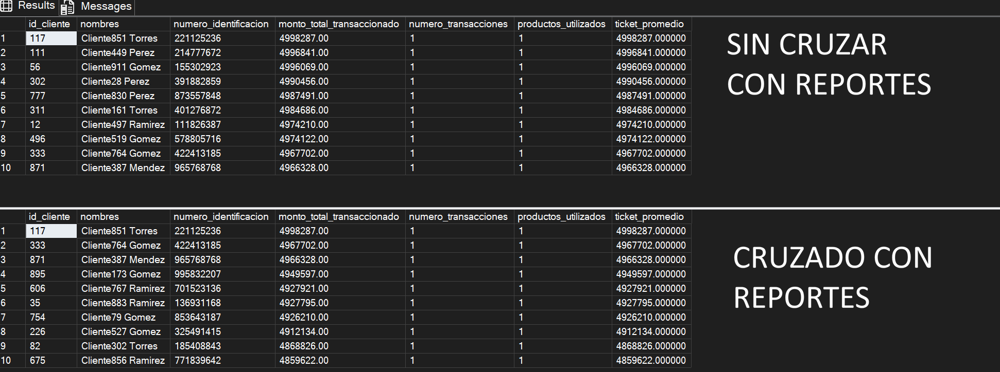

# Prueba Técnica — Ingeniería de Datos (Banco de Bogota)

# 📌 Parte 3: Explotación y Acceso a los Datos (Práctico - Análisis)

## Instrucciones

1. Desarrolla una consulta en el DWH que identifique a los clientes más rentables, basándose en su historial transaccional.

2. Explica cómo se podría utilizar esta información para la democratización de datos en la organización, facilitando su consumo por parte de analistas y otras áreas de negocio.

---

## Criterios de Evaluación

a.	Consulta optimizada con uso de particionamiento y clustering.
b.	Claridad en la explicación del valor estratégico y operativo que aporta la información.
c.	Consideraciones de aspectos de seguridad y control de acceso.

## Respuesta
Se desarrollaron dos versiones de la consulta: una identifica a los clientes más rentables por monto total transaccionado, y una segunda versión más completa cruza ese resultado contra `fact.ReporteRiesgo`, excluyendo a quienes tienen algún reporte de central de riesgo, aislando así el segmento de mayor valor y menor exposición para el banco.

- `SQLServerQuery.sql`  ambas versiones, modelo lógico (SQL Server)
- `SQLQuerySynapse.sql` versión con cruce de riesgo, adaptada a Synapse con poda de partición.

**Figura 1.** Salida de la consulta con y sin cruzar con Reportes de Riesgo

Como se observa en la Figura 1, el cruce contra riesgo sí cambia el resultado de forma
material, clientes como el 111, 56, 302, 777, 311, 12 y 496 desaparecen del top 10 al tener reportes de central de riesgo asociados, siendo reemplazados por otros clientes igualmente rentables pero sin esa alerta, lo que confirma el valor real de tener un modelo en constelación que permite este tipo de cruce entre procesos de negocio distintos.

### a) Consulta optimizada con particionamiento y clustering
En la versión Synapse, el filtro `WHERE t.id_tiempo = 20240228` se aplica sobre la columna de partición en ambas tablas de hechos (`fact.Transacciones` y `fact.ReporteRiesgo`), permitiendo poda de partición. El `JOIN` y `GROUP BY` por `id_cliente` se benefician del
`CLUSTERED COLUMNSTORE INDEX ORDER (id_cliente)` definido en la Parte 1. Nota [con el dataset de prueba (un solo día de datos), la poda de partición no se puede demostrar empíricamente en rendimiento, ya que solo existe una partición con datos, ya que el diseño está pensado para el volumen real de producción, donde sí generaría impacto medible].

### b) Valor estratégico y operativo
- **Estratégico**: marketing puede dirigir campañas de retención y cross-sell específicamente al segmento de clientes rentables y sin alertas de riesgo, con mayor valor esperado y menor probabilidad de pérdida.

- **Operativo**: el área comercial recibe una lista ya depurada y accionable, sin necesidad de cruzar manualmente reportes de riesgo con transacciones cada vez que se requiere.
- **Democratización de datos**: publicando esta lógica como una vista (`gold.vw_ClientesRentablesSinRiesgo`) documentada en un catálogo, analistas de marketing o de negocio sin conocimientos de SQL avanzado pueden construir sus propios reportes en Power BI de forma autónoma, sin depender de que el equipo de datos entregue reportes uno por uno.

### c) Seguridad y control de acceso
- Acceso otorgado únicamente sobre la vista curada, nunca directo a `fact.Transacciones` ni
  `dim.Cliente` (`GRANT SELECT` acotado a la vista).
- **Dynamic Data Masking** sobre columnas sensibles (`numero_identificacion`, `correo`) si se llegan a exponer en reportes de consumo.
- **Row-Level Security** para limitar la vista por región/ciudad si el consumo se segmenta por zona geográfica.
- **Auditoría** de accesos a la vista vía Synapse Audit Logs / SQL Server Audit, relevante por regulación de datos financieros.