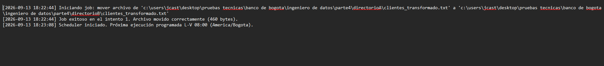
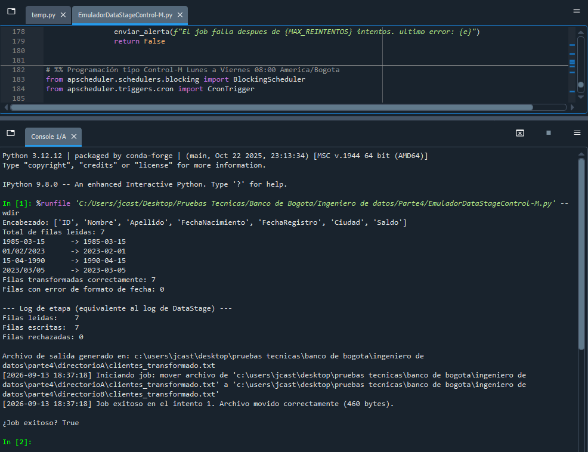

# Prueba Técnica — Ingeniería de Datos (Banco de Bogota)

# 📌 Procesamiento On-Premise con DataStage y Control-M  (Emulado con Python)

## Instrucciones

1. **Tomar un archivo plano (clientes_input.txt) con 7 columnas separadas por | y fechas en formatos mixtos.**

2. **En DataStage:**
   - Estandarizar todas las fechas a YYYY-MM-DD.
   - Cambiar el delimitador de | a , (pipe a coma)
   - Generar el archivo de salida transformado.
   
3. **En Control-M**
   - Orquestar el movimiento del archivo transformado del directorio A al directorio B.
   - Calendarización obligatoria: configurar la ejecución de lunes a viernes a las 08:00 (zona horaria America/Bogota), con manejo de reintentos y alertas ante fallos.

---

## A tener en cuenta:

###	Transmisión: validar completitud, existencia y tamaño esperado del archivo; usar banderas/semáforos si aplica; asegurar que el proceso pueda re-ejecutarse sin generar duplicados ni inconsistencias.
###	Parametrías necesarias:
 -	Entrada: ruta_origen, nombre_archivo, delimitador_entrada, formatos_fecha_detectados.
 -	Proceso: formato_fecha_objetivo (YYYY-MM-DD), delimitador_salida (,), políticas de reintento, umbral de tamaño.
 -	Salida: ruta_destino, patrón_nombre_salida (con fecha/hora), ruta_logs, ruta_evidencias.
###	Salidas de ejecución (obligatorias):
 -	Transformación (DataStage): archivo resultante + log de etapa (stats, filas leídas/escritas, rechazadas).
 -	Ejecución (Control-M): job con calendario L-V 08:00, historial de run, código de retorno, y evidencias del movimiento (origen/destino, checksums opcionales).

## Respuesta

**Script**: `EmuladorDataStageControl-M.py`, organizado en celdas `# %%` para poder ejecutarse y explicarse paso a paso, dividido conceptualmente en dos bloques:

### Bloque DataStage (celdas 1-6)
- Lee `clientes_input.txt` desde `directorioA`.
- `normalizar_fecha()` detecta el formato de cada fecha por la posición del año (4 dígitos) y la convierte a `YYYY-MM-DD`, cubriendo los 4 formatos mixtos presentes en el archivo(`YYYY-MM-DD`, `YYYY/MM/DD`, `DD-MM-YYYY`, `DD/MM/YYYY`).
- Cambia el delimitador de `|` a `,` y genera `clientes_transformado.txt` en `directorioA`.

### Bloque Control-M (celdas 7-11)
- `job_mover_archivo()` valida existencia y tamaño del archivo origen, mueve el archivo a
  `directorioB`, y verifica que el tamaño en destino coincida con el original.
- Reintenta hasta 3 veces con 5 segundos de espera entre intentos ante cualquier fallo.
- `enviar_alerta()` registra un mensaje de alerta en el log si se agotan los reintentos.
- Programado con `APScheduler` (`CronTrigger`) para ejecutarse **lunes a viernes 08:00,
  zona horaria America/Bogota**, configuración comentada en el script para no bloquear el
  proceso durante las pruebas manuales.
- **Idempotencia**: si el job se re-ejecuta sin que haya un archivo nuevo en `directorioA` (porque ya fue movido en una corrida anterior), falla de forma controlada con `FileNotFoundError` y genera una alerta, no duplica ni sobrescribe nada en `directorioB`.

### Evidencia de ejecución
- `control_m_log.txt`, historial de runs con timestamp, resultado y bytes movidos.
- `directorioA/clientes_input.txt` → `directorioB/clientes_transformado.txt` (delimitador y
  fechas transformados, archivo movido físicamente entre carpetas).

**Figura 1.** Log de ejecución mostrando un job exitoso y el inicio del scheduler.

**Figura 2.** Ejecución completa en consola: lectura (7 filas), normalización de fechas,
transformación sin rechazos, generación del archivo, y movimiento exitoso por Control-M
en el primer intento.

